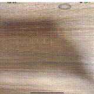

# About
ポートフォリオとかです。

## 特技
親指を手の甲にくっつけられます

googleさんの[mediapipeリポジトリ](https://github.com/google/mediapipe)使いました

# 利用可能OS
- Windows
- Mac
- Ubuntu

# 使用可能言語
- C#、C++、Python、Swift、Javascript、TypeScript、HTML、CSS、Ruby

# 使用可能フレームワーク・ライブラリ
- React、Nuxt.js、Tailwind CSS、webpack、Jest、pybind11、flask、Django、Three.js、Rails、tensorflow、Electron

# Works
- [GitHub](https://github.com/SasuraiNoHoge)
- 作った作品
  - [深度画像から.objファイルの作成](https://github.com/SasuraiNoHoge/createObj)
  - [sequelize使わずにnode.js使ってSQLインジェクション脆弱性再現してみた](https://github.com/SasuraiNoHoge/sqlInjection#yarn-install%E3%81%97%E3%81%A6%E3%81%8F%E3%81%A0%E3%81%95%E3%81%84)
  - [XcodeプロジェクトをBazelでビルドしてみよう](https://sasurainohoge.github.io/ios-app-tutorial/)
  - [Open3dを使ってスクリプトだけで3D空間のCGを撮影する](https://github.com/SasuraiNoHoge/CapturingOpen3d)
  -  [Nuxt.jsとReact、TypeScriptを用いた文字起こしアプリ](https://transcript-app.vercel.app/)
  - [Miyazawa of Cheap Galaxy](https://www.openprocessing.org/sketch/825171/)  
